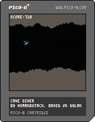

# PICO-8 Projects
## Draw
### Description
Draw is a program designed to help you make pixel art in PICO-8.

||
|:-:|
|Draw cartridge|

The program features a mouse mode and a keyboard mode. You can select the mode, along with the cursor speed in the bottom menu.

### Controls
To draw, use the ❎ button. To select, use the 🅾️ button. To move the cursor (in keyboard mode), use the arrow keys.

## Cave Diver
### Description
Cave diver is a game made following [Dylan Bennett's Tutorial](https://mboffin.itch.io/gamedev-with-pico-8-issue1). A few things were changed, such as sprites, sounds, behavior and even the code itself, which is now object-oriented.

In this game, you control a bird that has to dive into a cave. You have to avoid the walls at all costs, or you'll lose. As you progress, your score will increase, so try to get as far as you can!

||
|:-:|
|Cave Diver cartridge|

### Controls
To jump, use the top arrow key, and that's it!