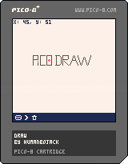

# PICO-8 Projects
## Draw
### Description
Draw is a program designed to help you make pixel art in PICO-8.

||
|:-:|
|Draw cartridge|

The program features a mouse mode and a keyboard mode. You can select the mode, along with the cursor speed in the bottom menu.

### Controls
To draw, use the ❎ button. To select, use the 🅾️ button. To move the cursor (in keyboard mode), use the arrow keys.